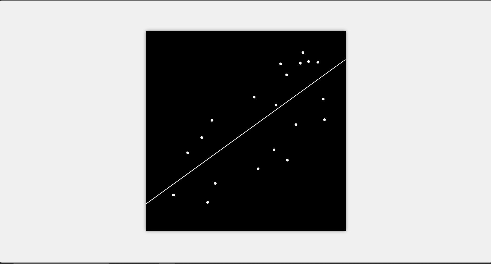
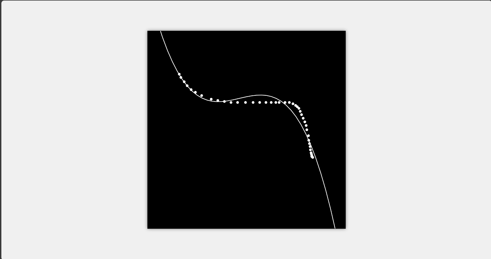

# 📈 Linear Regression with TensorFlow.js and p5.js

This project combines the power of the TensorFlow.js library for machine learning with the interactive visualization capabilities of the p5.js library.

## 🚀 Features

- **Interactive Points:** Click on the canvas to add points dynamically.
- **Real-time Adjustment:** The program employs linear regression to fit a line to the points, adjusting in real-time as more points are added. This results in changes to the slope and y-intercept to minimize the distance to all points.

## 🎨 Visualization
1. Linear Regression

2. Polynomial Regression


## 🛠️ How to Run

1. **Clone the Repository:**
    ```bash
    git clone https://github.com/priyanshu1044/Linear-Regression.git
    ```

2. **Navigate to the Repository:**
    ```bash
    cd Linear-Regression
    ```

3. **Open the HTML file:**
   - Double-click the HTML file to open it in your default browser.
   - Alternatively, use a local server if you have one set up.

## 📦 Dependencies

- **TensorFlow.js:** A JavaScript library for training and deploying ML models in the browser and on Node.js.
- **p5.js:** A JavaScript library that makes coding accessible for artists, designers, educators, and beginners.
